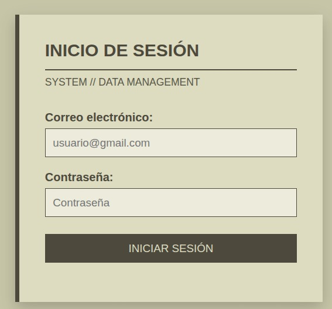
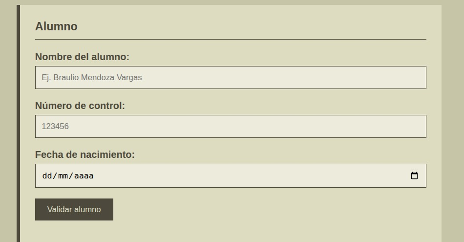
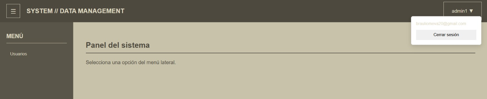
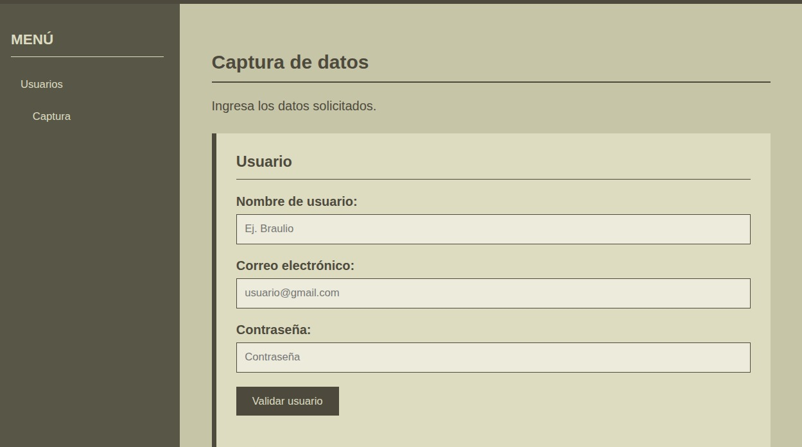

# SISTEMA DE USUARIOS

## Portada

### Actividad 5. Proyecto de Login — 

**Proyecto de Desarrollo Web**

**Integrantes del equipo:**

- Mendoza Vargas Braulio
- Perez Ramirez Samuel

**Tecnologías utilizadas:**

- HTML5
- CSS3
- JavaScript
- LocalStorage

**Framework CSS:** No se utilizó un framework CSS. El diseño fue realizado utilizando CSS propio.

---

# 1. Descripción del proyecto

El proyecto consiste en un sistema web de usuarios compuesto por dos pantallas principales: una pantalla de inicio de sesión y una pantalla principal de administración.

En login.html, el usuario ingresa su correo electrónico y contraseña. Primero se verifica que ambos datos tengan un formato válido mediante las funciones de utileria.js. Después, login.js compara las credenciales con las de un usuario registrado previamente en localStorage. También se cuenta con una cuenta administrativa inicial que permite acceder al sistema y registrar nuevos usuarios.

La segunda pantalla corresponde al sistema principal. Cuenta con un **navbar**, un **sidebar**, un menú de usuarios, un apartado de captura de información y un modal que muestra el resultado de la validación de edad de un alumno.

El sistema también permite validar:

- Correo electrónico.
- Contraseña.
- Nombre del usuario.
- Nombre del alumno.
- Número de control de 6 dígitos.
- Fecha de nacimiento.
- Edad del alumno.
- Mayoría o minoría de edad.

---

# 2. Tecnologías utilizadas

## HTML5

HTML5 se utilizó para construir la estructura de las dos pantallas del proyecto.

El archivo `login.html` contiene la estructura correspondiente al inicio de sesión, incluyendo los campos de correo, contraseña y el botón para iniciar sesión.

El archivo `index.html` contiene la estructura principal del sistema, incluyendo el navbar, sidebar, formularios de captura y modal.

---

## CSS3

El diseño visual fue realizado utilizando CSS3 propio.

No se utilizó Bootstrap, Tailwind CSS ni otro framework CSS.

Se utilizaron archivos CSS separados para mantener organizado el proyecto:

```text
css/
├── login.css
└── index.css
```

El diseño utiliza una combinación de colores beige y café, con una interfaz sencilla y enfocada en la funcionalidad del sistema.

---

## JavaScript

JavaScript se utiliza para realizar las validaciones, controlar la navegación entre las diferentes partes del sistema y manejar la sesión del usuario.

Los archivos principales de JavaScript son:

```text
js/
├── utileria.js
├── login.js
├── navbar.js
└── captura.js
```

---

# 3. Estructura del proyecto

La estructura utilizada para organizar el proyecto es:

```text
Proyecto/
│
├── README.md
├── login.html
├── index.html
│
├── css/
│   ├── login.css
│   └── index.css
│
├── js/
│   ├── utileria.js
│   ├── login.js
│   └── captura.js
│
└── img/
    └── Captura1.jpeg
```

---

# 4. Flujo del login hacia el sistema

El funcionamiento del sistema comienza en login.html, donde el usuario ingresa su correo electrónico y contraseña, el formulario utiliza las funciones validarCorreo() y validarPassword() de la librería utileria.js para comprobar que los datos tengan un formato válido.

Después de validar el formato, `login.js` compara las credenciales ingresadas con las almacenadas previamente en localStorage. También existe una cuenta administrativa inicial que permite ingresar al sistema y registrar nuevos usuarios.

### Flujo general

```text
          login.html
              │
              ▼
    Correo y contraseña
              │
              ▼
 validarCorreo() y validarPassword()
              │
       ┌──────┴──────┐
       │             │
   Inválidos      Válidos
       │             │
       ▼             ▼
 Mostrar error   Comparar credenciales
                     │
             ┌───────┴───────┐
             │               │
       No coinciden       Coinciden
             │               │
             ▼               ▼
      Mostrar error     Guardar sesión
                             │
                             ▼
                         index.html
```

Cuando las credenciales son correctas, se guardan temporalmente el nombre y el correo del usuario que inició sesión:

localStorage.setItem("usuarioSesion", usuario.nombre);
localStorage.setItem("correoSesion", usuario.correo);

Después, el sistema redirige a index.html, donde estos datos se utilizan para mostrar el nombre y correo del usuario en el navbar.

---

# 5. ¿Cómo se pasa el nombre de usuario al navbar?

Para mantener la información del usuario entre el login y el sistema se utiliza `localStorage`.

Cuando el usuario inicia sesión correctamente, JavaScript guarda el dato:

```javascript
localStorage.setItem("usuarioSesion", correo);
```

Después, cuando se abre `index.html`, JavaScript recupera el dato:

```javascript
let usuarioSesion =
    localStorage.getItem("usuarioSesion");
```

Posteriormente se coloca el valor recuperado dentro del elemento del navbar:

```javascript
document.getElementById("nombreUsuarioNavbar").textContent =
    usuarioSesion;
```

También se muestra el correo en el menú desplegable del usuario.

En `index.html` existe específicamente un elemento destinado a mostrar el nombre del usuario:

```html
<span id="nombreUsuarioNavbar">USUARIO</span>
```

y otro para mostrar el correo:

```html
<span id="correoUsuarioNavbar"></span>
```

### Flujo de información

```text
Correo ingresado
      │
      ▼
Validación
      │
      ▼
localStorage
      │
      ▼
index.html
      │
      ▼
JavaScript recupera el usuario
      │
      ▼
Navbar
      │
      ├── Nombre
      │
      └── Correo
```

De esta manera no es necesario utilizar una base de datos para este ejercicio, ya que la sesión se simula mediante `localStorage`.

---

# 6. Métodos y funciones principales

## validarCorreo()

Comprueba que el correo electrónico tenga un formato válido.

```javascript
validarCorreo(correo)
```

Se utiliza tanto en el login como en el formulario de captura de usuarios.

---

## validarPassword()

Comprueba que la contraseña cumpla con los requisitos establecidos.

```javascript
validarPassword(password)
```

La contraseña debe contener:

- Mínimo 8 caracteres.
- Una letra mayúscula.
- Una letra minúscula.
- Un número.
- Un carácter especial.

---

## soloLetras()

Permite comprobar que un texto contenga solamente letras y espacios.

```javascript
soloLetras(texto)
```

Se utiliza principalmente para validar el nombre del alumno.

---

## validarLongitud()

Comprueba que un valor no supere una longitud determinada.

```javascript
validarLongitud(numero, maxLongitud)
```

Se utiliza para controlar la longitud del número de control.

---

## calcularEdad()

Calcula la edad de una persona a partir de su fecha de nacimiento.

```javascript
calcularEdad(fechaNacimiento)
```

---

## esMayorDeEdad()

Determina si la persona tiene 18 años o más.

```javascript
esMayorDeEdad(fechaNacimiento)
```

El resultado se muestra posteriormente mediante el modal.

---

# 7. Proceso de creación

## Paso 1. Creación del login

Primero se creó `login.html`.

Se agregaron los elementos necesarios para que el usuario pueda ingresar:

- Correo electrónico.
- Contraseña.
- Botón de inicio de sesión.
- Mensajes de error.

El formulario se identificó mediante:

```html
<form id="formLogin">
```

Esto permite que JavaScript pueda detectar el envío del formulario y realizar las validaciones.

El diseño visual se agregó posteriormente mediante `login.css`.

### Captura del login



---

# 8. Creación del Navbar

Una vez creado el login se desarrolló la pantalla principal.
En la parte superior se agregó el navbar.

El navbar contiene:

- Botón de menú.
- Nombre del sistema.
- Nombre del usuario.
- Menú desplegable.
- Correo del usuario.
- Botón para cerrar sesión.

El nombre del usuario se coloca dinámicamente mediante JavaScript.

### Captura del Navbar



---

# 9. Creación del Sidebar

Después se agregó el menú lateral o sidebar.

El sidebar contiene la opción:

```text
MENÚ
 └── Usuarios
      └── Captura
```

El botón **Usuarios** permite mostrar u ocultar el submenu.

Dentro del submenu se encuentra la opción **Captura**.

### Captura del Sidebar



---

# 10. Creación del apartado de captura

Al seleccionar **Captura**, se oculta la pantalla inicial y se muestra la sección correspondiente a la captura de información.

La sección contiene dos formularios.

### Formulario de usuario

Permite ingresar:

- Nombre de usuario.
- Correo electrónico.
- Contraseña.

Los datos son validados utilizando las funciones de `utileria.js`.

### Formulario de alumno

Permite ingresar:

- Nombre del alumno.
- Número de control.
- Fecha de nacimiento.

### Captura del formulario



---

# 11. Validación del número de control

El número de control debe contener exactamente **6 dígitos**.

En HTML se estableció una longitud máxima de seis caracteres:

```html
maxlength="6"
```

Además, JavaScript verifica que solamente se introduzcan números y que la longitud sea exactamente de seis dígitos.

Ejemplo válido:

```text
123456
```

Ejemplos no válidos:

```text
12345
1234567
ABC123
```

### Captura del número de control


---

# 12. Creación del modal de edad

Finalmente se creó un modal para mostrar el resultado de la edad del alumno.

Después de validar:

- Nombre.
- Número de control.
- Fecha de nacimiento.

JavaScript calcula la edad mediante:

```javascript
calcularEdad(fecha)
```

Después se determina si el alumno es mayor o menor de edad mediante:

```javascript
esMayorDeEdad(fecha)
```

El resultado se muestra dentro del modal.

El modal contiene:

- Título.
- Resultado de la edad.
- Botón para aceptar.
- Botón para cerrar.

### Captura del modal


---

# 13. Cerrar sesión

El sistema también cuenta con una opción para cerrar sesión.

Cuando el usuario selecciona **Cerrar sesión**, se elimina el dato almacenado en `localStorage`:

```javascript
localStorage.removeItem("usuarioSesion");
localStorage.removeItem("correoSesion");
```

Después el usuario es enviado nuevamente a:

```text
login.html
```

Esto evita que el sistema conserve la sesión simulada después de cerrar sesión.

---
## Inicio de sesión


## Datos del alumno


## Sidebar


## Captura de datos


---

